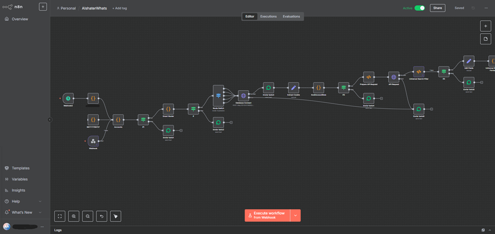
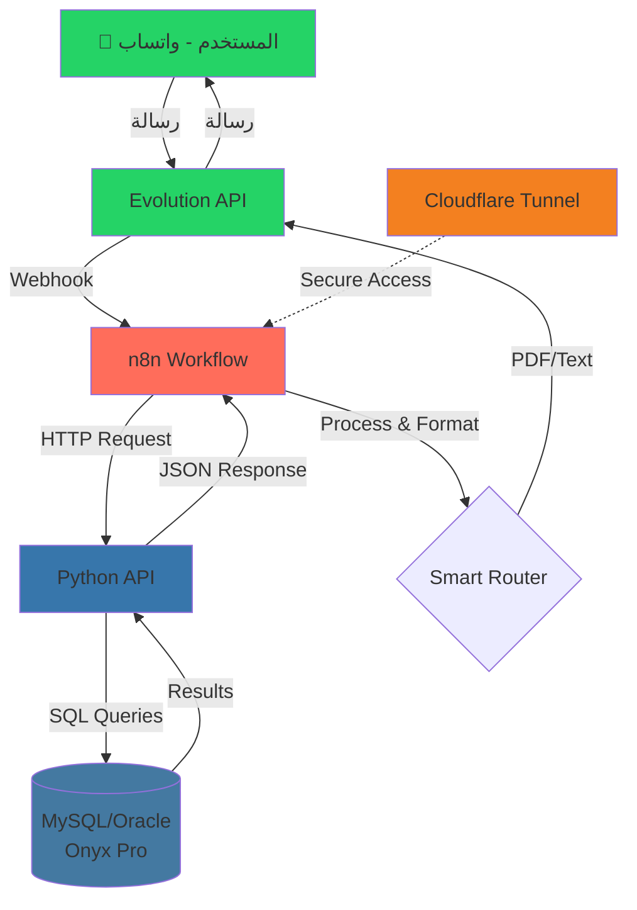

# 📱Automated Business Intelligence System

<div align="center">



**نظام متكامل لأتمتة استعلامات الأعمال عبر واتساب**

[](https://evolution-api.com/)
[](https://n8n.io/)
[](https://www.python.org/)
[](https://www.mysql.com/)
[](https://www.cloudflare.com/)

</div>

---

## 📋 جدول المحتويات

- [نظرة عامة](#-نظرة-عامة)
- [الأدوات والتقنيات المستخدمة](#-الأدوات-والتقنيات-المستخدمة)
- [هيكل النظام والبنية التحتية](#-هيكل-النظام-والبنية-التحتية)
- [تدفق العمل (Workflow)](#-تدفق-العمل-workflow)
- [الأوامر والوظائف المتاحة](#-الأوامر-والوظائف-المتاحة)
- [الميزات الرئيسية](#-الميزات-الرئيسية)
- [الأعمال المجدولة (Scheduled Jobs)](#-الأعمال-المجدولة-scheduled-jobs)
- [أمثلة عملية](#-أمثلة-عملية)
- [الخلاصة](#-الخلاصة)

---

## 🎯 نظرة عامة

هو حل متكامل لأتمتة عمليات استعلام البيانات مع نظام Onyx Pro لإدارة الأعمال (من شركة يمن سوفت) عبر تطبيق واتساب.
يسمح النظام للمستخدمين بالحصول على المعلومات المطلوبة بشكل فوري ومنظم عبر واتساب بدون الحاجة للدخول إلى النظام مباشرة.

### الهدف من المشروع

- ✅ **سهولة الوصول**: الحصول على بيانات العملاء والموردين والحسابات من أي مكان
- ✅ **استجابة فورية**: ردود تلقائية فورية على استعلامات المستخدمين
- ✅ **تكلفة صفرية**: استخدام evolution-api للاتصال المجاني بواتساب
- ✅ **بساطة التثبيت**: حل بسيط بدون متطلبات معقدة مثل Docker
- ✅ **الأمان والخصوصية**: استضافة محلية مع نفق Cloudflare آمن
- ✅ **أتمتة كاملة**: إرسال تلقائي لكشوف الحسابات بشكل مجدول إلى أرقام محددة

---

## 🛠️ الأدوات والتقنيات المستخدمة

###  Evolution API

**الدور**: ربط أرقام واتساب مع n8n  
**الميزة الرئيسية**: إرسال واستقبال الرسائل عبر واتساب **بشكل مجاني تماماً** بدون أي تكلفة

- 📨 استقبال الرسائل الواردة من المستخدمين
- 📤 إرسال الردود والنتائج كرسائل نصية أو ملفات PDF
- 🔄 تكامل سلس مع n8n عبر Webhooks

---

###  n8n

**الدور**: منصة أتمتة سير العمل  
**التكوين**: 
- 📍 استضافة محلية على السيرفر
- 🌐 ربط مع الدومين عبر Cloudflare Tunnel
- 🔐 نفق آمن (Tunnel) للوصول الخارجي

**المهام**:
- 🔀 التوجيه الذكي للرسائل (Smart Router)
- 🔍 معالجة وتحليل الرسائل الواردة
- 📊 تطبيق الشروط والأدوار والمستخدمين
- 🎯 توجيه الطلبات إلى API المناسب

---

###  Python API

**الدور**: واجهة برمجية للاتصال بقاعدة البيانات  
**الميزات**:
- 🔌 اتصال آمن مع قاعدة بيانات Oracle
- 🔄 Connection Pooling للأداء الأمثل
- 📝 تنفيذ استعلامات Onyx Pro
- 🛡️ معالجة الأخطاء والاستثناءات

**البنية**:
```
http://127.0.0.1:5000/
├── customers     # استعلامات العملاء
├── suppliers     # استعلامات الموردين
├── inventory     # استعلامات الأصناف
├── accounts      # استعلامات الحسابات
└── statements    # كشوف الحسابات
```

---

###  Oracle Database

**الدور**: قاعدة بيانات نظام Onyx Pro الأساسي  
**النظام**: Onyx Pro من شركة يمن سوفت (Yemen Soft)

- 🗄️ تخزين بيانات العملاء والموردين
- 📦 إدارة المخزون والأصناف
- 💰 الحسابات والحركات المالية
- 📊 كشوف الحسابات والفواتير

---

###  Cloudflare Tunnel

**الدور**: نفق آمن للوصول الخارجي  
**الميزات**:
- 🔒 حماية السيرفر المحلي
- 🌍 الوصول من الإنترنت بدون فتح منافذ
- 🚫 لا حاجة لـ IP ثابت
- ⚡ أداء عالي وموثوقية

---

## 🏗️ هيكل النظام والبنية التحتية

### البنية المعمارية



### تدفق البيانات التفصيلي

1. **المرحلة 1: الاستقبال**
   - 📨 المستخدم يرسل رسالة عبر واتساب
   - Evolution API يستقبل الرسالة
   - يتم إرسال Webhook إلى n8n

2. **المرحلة 2: المعالجة**
   - n8n يستقبل البيانات عبر Webhook
   - Smart Router يحلل الرسالة ويحدد نوع الطلب
   - التحقق من الصلاحيات والمستخدمين

3. **المرحلة 3: الاستعلام**
   - n8n يرسل HTTP Request إلى Python API
   - Python API يتصل بقاعدة بيانات Onyx Pro
   - تنفيذ الاستعلام المناسب

4. **المرحلة 4: الرد**
   - Python API يعيد النتائج كـ JSON
   - n8n يقوم بمعالجة وتنسيق البيانات
   - تصدير النتائج كـ PDF أو نص
   - إرسال الرد عبر Evolution API إلى واتساب

### التكوين التقني

- **الاستضافة**: محلية (Local Hosting)
- **النفق**: Cloudflare Tunnel للوصول الخارجي
- **قاعدة البيانات**: MySQL/Oracle (Onyx Pro)
- **عدم استخدام**: Docker (بسبب عدم دعم السيرفر)

---

## 🔄 تدفق العمل (Workflow)

### نظرة عامة على الـ Workflow


*الشكل أعلاه يوضح البنية الكاملة لسير العمل في n8n*

### مراحل العمل التفصيلية

#### 1️⃣ **نقاط الدخول (Entry Points)**

```
Webhook2 (96777xxxxx) ──┐
                          ├─→ Accounts Node
Webhook (967777706727) ───┘
```

- **Webhooks**: نقطتان لدخول الرسائل من رقمين مختلفين
- **Accounts Node**: التحقق من بيانات المستخدم والحساب

#### 2️⃣ **التحقق من الحسابات**

```
Accounts → IF1 (Condition Check)
         ├─ True → Smart Router
         └─ False → Enviar texto1 (Error Message)
```

- التحقق من صحة البيانات المستلمة
- التحقق من وجود حساب مستخدم صحيح
- إرسال رسالة خطأ إذا فشل التحقق

#### 3️⃣ **التوجيه الذكي (Smart Router)**

```
Smart Router → IF (Advanced Routing)
             ├─ True → Route Switch
             └─ False → Enviar texto2
```

**وظيفة Smart Router**:
- 🔍 تحليل نص الرسالة
- 🎯 التعرف على الكلمات المفتاحية أو الأكواد الرقمية
- 📋 تحديد نوع الاستعلام (عميل/مورد/صنف/حساب)
- 🔢 تحديد طريقة البحث (بالاسم أو بالرقم)
- 📅 استخراج التواريخ والعملات

**خريطة التوجيه**:
```javascript
// الأكواد الرقمية
100-103 → العملاء
200-203 → الموردين  
300-301 → الأصناف
400-404 → الحسابات

// الكلمات المفتاحية
"اسم العميل" → بحث عملاء بالاسم
"رقم الحساب" → بحث حساب بالرقم
"كشف حساب..." → كشف حساب مع تواريخ
```

#### 4️⃣ **الاتصال بقاعدة البيانات**

```
Route Switch → Database Connect (POST)
             ├─ Success → Enviar texto3 → Extract Cookie
             └─ Error → Error Handling
```

- **Database Connect**: الاتصال بـ Python API على `http://127.0.0.1:5000/`
- **Extract Cookie**: استخراج بيانات الجلسة والمصادقة
- معالجة الأخطاء عند فشل الاتصال

#### 5️⃣ **تطبيق القواعد (Rules Application)**

```
Extract Cookie → ExaltAccountRule
```

- تطبيق قواعد الحسابات المتخصصة
- التحقق من الصلاحيات والأدوار
- تطبيق الشروط الخاصة

#### 6️⃣ **طلبات API والبحث**

```
ExaltAccountRule → IF3
                 ├─ True → Prepare API Request → API Request
                 └─ False → Enviar texto4

API Request:
├─ Success → Universal Search Filter
└─ Error → Enviar texto6
```

- **Prepare API Request**: تحضير طلب API مع المعاملات
- **API Request**: تنفيذ الطلب الفعلي
- **Universal Search Filter**: تصفية وفلترة النتائج

#### 7️⃣ **إرسال النتائج**

```
Universal Search Filter → IF4
                        ├─ True → Edit Fields → Universal Response
                        └─ False → Enviar texto5
```

- **Edit Fields**: تعديل وتنسيق البيانات النهائية
- **Universal Response**: إعداد الرد النهائي
- **Enviar texto**: إرسال الرسائل عبر Evolution API

---

## 📚 الأوامر والوظائف المتاحة

### 📊 جدول شامل لجميع الأوامر

#### 👤 **العملاء (Customers)**

| الكود | الأمر النصي | الوصف | الصيغة | مثال |
|------|-------------|-------|--------|------|
| `100` | `اسم العميل` | البحث عن عميل بالاسم | `100#اسم العميل` | `100#محمد أحمد` |
| `101` | `رقم العميل` | البحث عن عميل بالرقم | `101#رقم العميل` | `101#12345` |
| `102` | `كشف حساب رقم العميل` | كشف حساب عميل بالرقم | `102#رقم#من تاريخ#إلى تاريخ#عملة` | `102#12345#01/01/2025#31/12/2025#SAR` |
| `103` | `كشف حساب اسم العميل` | كشف حساب عميل بالاسم | `103#الاسم#من تاريخ#إلى تاريخ#عملة` | `103#محمد أحمد#01/01/2025#31/12/2025#SAR` |

---

#### 🧾 **الموردين (Suppliers)**

| الكود | الأمر النصي | الوصف | الصيغة | مثال |
|------|-------------|-------|--------|------|
| `200` | `اسم المورد` | البحث عن مورد بالاسم | `200#اسم المورد` | `200#شركة التجارة` |
| `201` | `رقم المورد` | البحث عن مورد بالرقم | `201#رقم المورد` | `201#54321` |
| `202` | `كشف حساب اسم المورد` | كشف حساب مورد بالاسم | `202#الاسم#من تاريخ#إلى تاريخ#عملة` | `202#شركة التجارة#01/01/2025#31/12/2025#YER` |
| `203` | `كشف حساب رقم المورد` | كشف حساب مورد بالرقم | `203#رقم#من تاريخ#إلى تاريخ#عملة` | `203#54321#01/01/2025#31/12/2025#YER` |

---

#### 📦 **الأصناف والمخازن (Inventory)**

| الكود | الأمر النصي | الوصف | الصيغة | مثال |
|------|-------------|-------|--------|------|
| `300` | `اسم الصنف` | البحث عن صنف بالاسم | `300#اسم الصنف#رقم المخزن` | `300#أسلاك نحاس#1` |
| `301` | `رقم الصنف` | البحث عن صنف بالرقم | `301#رقم الصنف#رقم المخزن` | `301#78901#1` |

---

#### 💰 **الحسابات (Accounts)**

| الكود | الأمر النصي | الوصف | الصيغة | مثال |
|------|-------------|-------|--------|------|
| `400` | `اسم الحساب` | البحث عن حساب بالاسم | `400#اسم الحساب` | `400#خالد العواضي` |
| `401` | `رقم الحساب` | البحث عن حساب بالرقم | `401#رقم الحساب` | `401#1222003` |
| `403` | `كشف حساب رقم الحساب` | كشف حساب بالرقم | `403#رقم#من تاريخ#إلى تاريخ#عملة` | `403#1222003#01/12/2025#30/12/2025#SAR` |
| `404` | `كشف حساب اسم الحساب` | كشف حساب بالاسم | `404#الاسم#من تاريخ#إلى تاريخ#عملة` | `404#خالد العواضي#01/12/2025#30/12/2025#SAR` |

---

### 🎯 الأوامر الخاصة

#### **كشف اليوم** (للمستخدمين المصرحين)

```
كشف اليوم
```

**المستخدمون المصرحون**: `967777706727`, `96777xxxxx`, `96777xxxxx`

- يعرض كشف حساب رقم `1222003` لليوم الحالي تلقائياً
- لا يحتاج أي معاملات إضافية

---

### 📝 قواعد الاستخدام

#### **صيغة الرسالة الأساسية**

```
[الكود أو الأمر النصي]#[المعامل 1]#[المعامل 2]#[المعامل 3]#[المعامل 4]
```

#### **الأسماء متعددة الكلمات**

إذا كان الاسم يحتوي على أكثر من كلمة وكل كلمة في مكان منفصل، استخدم `%` بين الكلمات:

```
100#اسكو%حديد
```

سيتم البحث عن: `اسكو حديد`

#### **الكشف من بداية السنة**

لجلب كشف حساب من بداية السنة حتى الآن:

```
كشف حساب اسم الحساب#خالد العواضي###SAR
```

(اترك التواريخ فارغة بعد علامة `#`)

#### **العملات المدعومة**

- `SAR` - الريال السعودي
- `YER` - الريال اليمني
- `USD` - الدولار الأمريكي
- `R.Y` - ريال يمني

#### **القيم الافتراضية**

- **من تاريخ**: إذا لم يتم التحديد، يبدأ من `01/01/[السنة الحالية]`
- **إلى تاريخ**: إذا لم يتم التحديد، ينتهي بتاريخ اليوم
- **العملة**: القيمة الافتراضية `0` (جميع العملات)

---

## ✨ الميزات الرئيسية

### 🆓 **ربط مجاني بواتساب**

- ✅ استخدام **Evolution API** للاتصال بواتساب بدون أي تكلفة
- ✅ إرسال واستقبال غير محدود
- ✅ لا حاجة لاشتراك واتساب بيزنس

### 🧠 **التوجيه الذكي (Smart Routing)**

- 🔍 تحليل ذكي للرسائل الواردة
- 🎯 توجيه تلقائي حسب نوع الطلب
- 👥 دعم الشروط والأدوار والمستخدمين
- 🔐 صلاحيات متدرجة للمستخدمين

### 📄 **تصدير التقارير**

- 📊 **PDF**: تصدير كشوف الحسابات كملفات PDF
- 💬 **نص**: إرسال النتائج كرسائل نصية منظمة
- 📈 **منظم**: تنسيق احترافي للبيانات

### 💱 **دعم متعدد العملات**

- 🇸🇦 الريال السعودي (SAR)
- 🇾🇪 الريال اليمني (YER)
- 🇺🇸 الدولار الأمريكي (USD)
- 💵 ريال يمني (R.Y)

### 🔎 **البحث المرن**

- 🔤 **بالاسم**: بحث باستخدام الأسماء الكاملة أو الجزئية
- 🔢 **بالرقم**: بحث مباشر برقم السجل
- 🔀 **مرن**: دعم الأسماء متعددة الكلمات

### 🔒 **الأمان والخصوصية**

- 🏠 **استضافة محلية**: البيانات تبقى على السيرفر المحلي
- 🌐 **Cloudflare Tunnel**: وصول آمن بدون فتح منافذ
- 🔐 **صلاحيات**: تحكم كامل في الوصول

### ⚡ **الأداء والسرعة**

- 🚀 **Connection Pooling**: إدارة فعالة لاتصالات قاعدة البيانات
- ⏱️ **استجابة فورية**: ردود سريعة على الاستعلامات
- 📊 **معالجة محسّنة**: تدفق بيانات فعال

### ⏰ **الأعمال المجدولة (Scheduled Jobs)**

- 📅 **إرسال تلقائي**: جدولة إرسال كشوف الحسابات في أوقات محددة
- 📱 **أرقام مخصصة**: إرسال إلى قائمة أرقام محددة مسبقاً
- 🔄 **تشغيل مستمر**: يعمل بشكل تلقائي بدون تدخل بشري
- ⏰ **جدولة مرنة**: يومي / أسبوعي / شهري / مخصص

---

## ⏰ الأعمال المجدولة (Scheduled Jobs)

يحتوي النظام على **نظام أعمال مجدولة تلقائي** يقوم بإرسال كشوف الحسابات بشكل دوري ومنتظم إلى أرقام واتساب محددة في أوقات مبرمجة مسبقاً.

### 🎯 **الميزات الرئيسية**

- 📅 **جدولة تلقائية**: إرسال كشوف الحسابات في أوقات محددة يومياً/أسبوعياً/شهرياً
- 📱 **أرقام مخصصة**: إرسال إلى قائمة أرقام محددة مسبقاً
- 📊 **كشوف مبرمجة**: كشوف حسابات محددة يتم إرسالها تلقائياً
- 🔄 **تشغيل مستمر**: يعمل بشكل تلقائي بدون تدخل بشري

### 📋 **كيفية العمل**

1. **الإعداد المسبق**:
   - تحديد قائمة الأرقام المستهدفة
   - تحديد كشوف الحسابات المطلوبة
   - تحديد مواعيد الإرسال (يومي/أسبوعي/شهري)

2. **التنفيذ التلقائي**:
   - n8n ينفذ العمل المجدول في الوقت المحدد
   - جلب البيانات من قاعدة البيانات
   - توليد كشف الحساب كملف PDF
   - إرسال الكشف عبر Evolution API إلى الأرقام المحددة

3. **النتيجة**:
   - وصول كشف الحساب تلقائياً إلى المستلمين
   - بدون الحاجة لطلب يدوي
   - تنفيذ موثوق ودقيق

### 💡 **أمثلة على الاستخدام**

#### **مثال 1: كشف يومي**
- **الموعد**: كل يوم الساعة 8:00 صباحاً
- **المستلمون**: الإدارة والمدراء
- **الكشف**: كشف حساب رقم `1222003` لليوم السابق

#### **مثال 2: كشف أسبوعي**
- **الموعد**: كل يوم جمعة الساعة 5:00 مساءً
- **المستلمون**: فريق المبيعات
- **الكشف**: ملخص مبيعات الأسبوع

#### **مثال 3: كشف شهري**
- **الموعد**: أول يوم من كل شهر الساعة 9:00 صباحاً
- **المستلمون**: الإدارة العليا
- **الكشف**: تقرير شامل عن الشهر السابق

### ⚙️ **الإعدادات المتاحة**

- ⏰ **التوقيت**: تحديد الساعة والدقيقة بدقة
- 📅 **التكرار**: يومي / أسبوعي / شهري / مخصص
- 📱 **الأرقام**: إضافة/حذف أرقام من قائمة المستلمين
- 📊 **الكشوف**: تحديد نوع وكود كشف الحساب
- 💱 **العملة**: اختيار عملة الكشف (SAR, YER, USD, R.Y)
- 📈 **الفترة**: تحديد فترة الكشف (من تاريخ إلى تاريخ)

### 🔧 **التكوين التقني**

- يتم استخدام **n8n Cron** أو **Schedule Trigger** لتحديد المواعيد
- يتم استدعاء نفس API المستخدم في الاستعلامات اليدوية
- يتم معالجة النتائج وتوليد PDF تلقائياً
- يتم الإرسال عبر Evolution API إلى الأرقام المحددة

### ✅ **الفوائد**

- 📊 **تقارير منتظمة**: الحصول على تقارير دورية بدون طلب يدوي
- ⏱️ **توفير الوقت**: لا حاجة لإرسال التقارير يدوياً كل مرة
- 🎯 **دقة المواعيد**: إرسال دقيق في الوقت المحدد
- 📱 **سهولة الوصول**: وصول التقارير مباشرة إلى واتساب
- 🔄 **موثوقية**: تشغيل مستمر وموثوق بدون توقف

---

## 💡 أمثلة عملية

### مثال 1: البحث عن عميل

**الرسالة المرسلة**:
```
100#محمد أحمد
```

**الرد المتوقع**:
```
✅ تم العثور على العميل:

الاسم: محمد أحمد
الرقم: 12345
العنوان: صنعاء، اليمن
الهاتف: 967XXXXXXXX
```

---

### مثال 2: كشف حساب عميل

**الرسالة المرسلة**:
```
102#12345#01/01/2025#31/12/2025#SAR
```

**الرد المتوقع**:
```
📊 كشف حساب العميل (الرقم: 12345)
من 01/01/2025 إلى 31/12/2025
- عملة: SAR

[مرفق ملف PDF بالكشف الكامل]
```

---

### مثال 3: البحث عن صنف

**الرسالة المرسلة**:
```
300#أسلاك نحاس#1
```

**الرد المتوقع**:
```
📦 استعلام الصنف (الاسم: أسلاك نحاس)
- مخزن: 1

الكمية المتاحة: 150 متر
السعر: 5000 YER
```

---

### مثال 4: كشف حساب من بداية السنة

**الرسالة المرسلة**:
```
404#خالد ...###SAR
```

**الرد المتوقع**:
```
💰 كشف حساب الحساب (الاسم: خالد ...)
من 01/01/2025 إلى [تاريخ اليوم]
- عملة: SAR

[ملف PDF بالكشف الكامل]
```

---

### مثال 5: الأمر الخاص - كشف اليوم

**الرسالة المرسلة** (من مستخدم مصرح):
```
كشف اليوم
```

**الرد المتوقع**:
```
📊 كشف حساب (رقم الحساب: 1222003)
بتاريخ: [تاريخ اليوم]

[ملف PDF بالكشف]
```

---

## 🎯 الخلاصة

### الإنجازات

✅ **تكامل كامل**: نظام متكامل يربط واتساب مع قاعدة بيانات Onyx Pro  
✅ **حل اقتصادي**: استخدام Evolution API يوفر التكلفة بالكامل  
✅ **بساطة التثبيت**: بدون متطلبات معقدة مثل Docker  
✅ **أمان عالي**: استضافة محلية مع نفق Cloudflare آمن  
✅ **سهولة الاستخدام**: واجهة بسيطة عبر واتساب  
✅ **أداء عالي**: معالجة سريعة وفعالة  
✅ **أتمتة كاملة**: أعمال مجدولة لإرسال التقارير تلقائياً  

### الفوائد والعوائد

📈 **زيادة الإنتاجية**: الوصول السريع للبيانات من أي مكان  
💰 **توفير التكلفة**: لا حاجة لاشتراكات واتساب بيزنس  
⏱️ **توفير الوقت**: استعلامات فورية بدون دخول النظام  
📊 **دقة المعلومات**: بيانات مباشرة من قاعدة البيانات الأساسية  
🔒 **الأمان**: تحكم كامل في الصلاحيات والوصول  
📱 **سهولة الوصول**: استخدام واتساب المعروف للجميع  

### التقنيات المستخدمة

- **Evolution API**: ربط واتساب مجاني
- **n8n**: أتمتة سير العمل
- **Python API**: واجهة قاعدة البيانات
- **MySQL/Oracle**: قاعدة بيانات Onyx Pro
- **Cloudflare Tunnel**: الوصول الآمن

---

<div align="center">

*نظام ذكي ومتكامل لأتمتة استعلامات الأعمال*

[](https://github.com)

</div>

